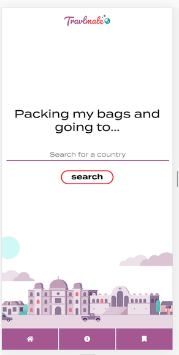
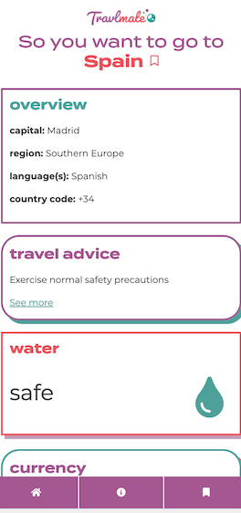
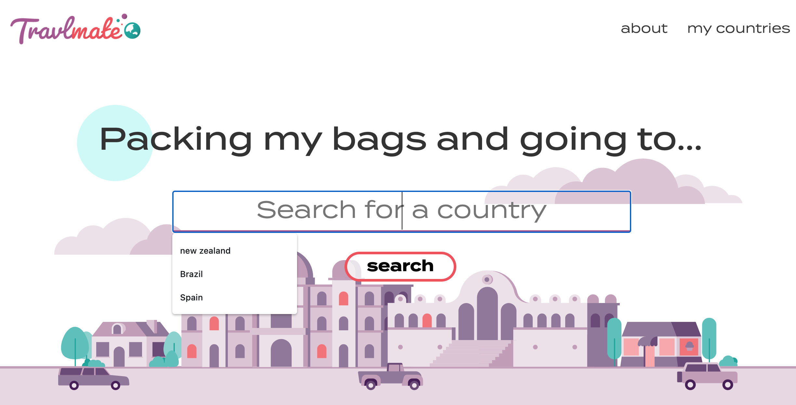

# Travlmate
TravlMate is a website for travel enthusiasts and bloggers to access helpful information that can aid planning for a trip or research for an article or post.

The benefit of the site is that it is a one-stop-shop for information. It saves users time and effort having to search across many sites for a variety of information they might need. Instead, TravlMate is an easy to use service that instantly collates valuable facts in one place, including currency, water safety, neighbouring countries and much more.

<i><b> Search for, learn about, and bookmark your destinations of interest all with one, easy-to-use site -  Travlmate. </i></b>

<b> Click the on the aeroplane and prepare for TAKE OFF...  </b>

<a href="https://ffakih5.github.io/Travelmate/"> ✈️</a>

## Table of contents
  - [Motivation](#motivation)
  - [User Story](#userstory)
  - [Acceptance Criteria](#acceptancecriteria)
  - [Process](#process)
  - [Built with](#built-with)
  - [Features](#features)
  - [Credits](#credits)

## Motivation
The motivation behind this project stemmed from the shared yearning to pack up and go on a trip by the members of the group. 

We drew on our personal experiences with travel and brought to light what we consider to be the key elements to ensuring you have a successful trip, wherever your destination may be!

## User Story
AS A traveller/ blogger 

I WANT to access a dashboard with useful information about the country I intend to visit/share about.

SO THAT I plan my trip accordingly.

## Acceptance Criteria
_GIVEN a travel dashboard with form inputs_

_WHEN I search for a country_

_THEN I am presented with an overview, currency, neighbours, travel advice, water quality and monthly average weather for that country_

_WHEN I view the overview for that country_

_THEN I am presented with the Capital city, spoken languages and country code_

_WHEN I view the currency for that country_ 

_WHEN I input an amount of AUD to exchange_

_THEN I am presented with the amount in the currency for that country_ 

_WHEN I click on the currency dropdown_

_THEN I am presented with a list of optional currencies to exchange_

_WHEN I view the neighbours for that country_ 

_THEN I am presented with a list of countries_

_WHEN I click on a neighbouring country_

_THEN I can view the information for that country and bookmark it_

_WHEN I view the travel advice for that country_

_THEN I am presented with the type of precautions to exercise_

_WHEN I click on the “see more” link in the travel advice_

_THEN I am presented with the official travel advice page in separate browser window_

_WHEN I view the water for that country_

_THEN I am presented with a water-drop icon and “safe” prompting it is safe to drink tap water_

_WHEN I view the water for that country_

_THEN I am presented with a water-drop icon with a strike-through it and “not safe”_

_WHEN I view the weather for that country_ 

_THEN I am presented with the average weather for the current month and the button for current month changes to red_

_WHEN I click on the month buttons in the weather_

_THEN I am presented with the average weather and the button changes to red_

_WHEN I click the bookmark icon_

_THEN I can add my searches to the “my countries list”_

_WHEN I VIEW my countries_

_THEN I am presented with a list of bookmarked Countries_

_WHEN I open the travel dashboard_

_THEN I am presented with the last searched country_

## Process
We began with concept creation which then centered around our Travel Briefing API. We knew we wanted an information hub for travellers, that would present a consolidated source of key travel insights for any country to make it easy to plan a trip or write a blog. 

We then came to the conclusion that the second API would be a currency converter as this was something we thought was missing from the Travel Brieifng API but important to our intended users.

We decided that we would need the site to have searchability as well as the ability to bookmark countries you had searched for before.

## Mockups
<b>Mobile Homepage</b> 

<b>Mobile Dashboard</b> 

<b>Desktop Homepage</b> 

## Built with
- [UI Kit](https://getbootstrap.com/)
- [JQuery](https://jquery.com/)
- [Moment.js](https://momentjs.com/)
- [Adobe XD](https://www.adobe.com/au/products/xd.html) (prototyping)
- [Travel Briefing API](https://travelbriefing.org/api) to pull country information
- [Free Currency Converter API ](https://free.currencyconverterapi.com/) to convert currenices
- [Rest Countries API](https://restcountries.eu/) to display capital cities, regions and languages

## Features
- Search for any country 
- Automatically save search history 
- Bookmark countries to view later
- Display key information on a dashboard
- Convert currency to your chosen currency using current rates
- Display currency rates for the 10 most traded currencies
- About section to inform users of the purpose of the site
- Links to neighbouring countries to view or bookmark for later
- Links to search Google for travel information if it cannot be found by the API
- Mobile Responsive site

## Functionality 
<b>See deployed link here:</b>

<a href="https://ffakih5.github.io/Travelmate/dashboard/index.html"> Travlmate</a>

## Credits
All icons credited to https://fontawesome.com/

All Images credited to https://blush.design/